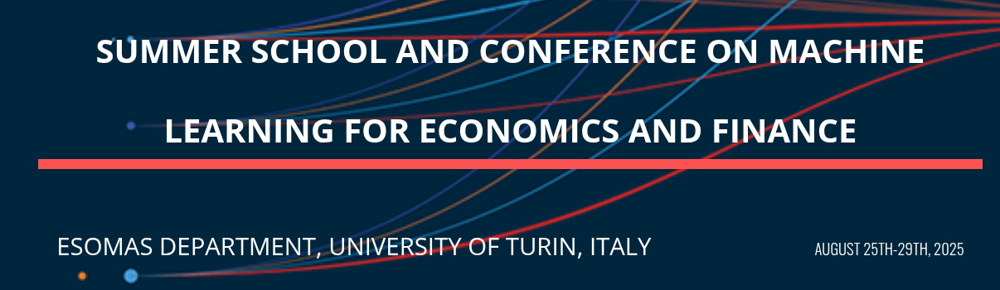

Summer School on [Deep Learning for Economics and Finance](https://sites.google.com/carloalberto.org/thesummerschool2025unito/home?authuser=0), held at [ESOMAS](https://www.esomas.unito.it/do/home.pl), August 25 - 27, 2025, at the University of Torino. 

## Purpose of the lectures

* This summer school is designed for Ph.D. students and reseaerchers in economics and related disciplines. It
introduces recent advancements in machine learning, computational
science, and the computational economics and finance literature. 
* The course focuses on solving and estimating dynamic stochastic economic models, and solving continuous-time models (that is, partial differential equations).
* The lectures will concentrate on machine learning methodologies, including Deep Neural Networks, Gaussian Processes, Physics-informed Neural Nets. These methods will be explored through applications in macroeconomics, finance, and climate-change economics.
* The format of the lectures will be interactive and workshop-like, combining theoretical discussions with hands-on coding exercises. 
* The coding will be conducted in Python and implemented on a cloud computing infrastructure [Nuvolos](https://nuvolos.com).

## Prerequisites

* Basic econometrics.
* Basic programming in Python (see [this link to QuantEcon](https://python-programming.quantecon.org/intro.html) for a thorough introduction).
* A brief Python refresher is provided [under this link](python_refresher).
* A brief Python on Jupyter Notebooks is provided [under this link](python_refresher/jupyter_intro.ipynb). 
* Basic calculus and probability (The book [Mathematics for Machine learning](https://mml-book.github.io/) provides a good overview of skills participants are required to be fluent in). 

## Class enrollment on the [Nuvolos Cloud](https://nuvolos.cloud/)

* All lecture materials (slides, codes, and further readings) will be distributed via the [Nuvolos Cloud](https://nuvolos.cloud/).
* To enroll in this class, please click on this [enrollment key](https://app.nuvolos.cloud/enroll/class/_lQSiRolH94), and follow the steps.

### Novolos Support

- Nuvolos Support: <support@nuvolos.cloud>

### On-site Support

- For any organizational question, please write to the default email address of the summer school: <deeplearningconf25@gmail.com>

- For any question regarding whereabouts, local assistance, etc., there is a team of students that is avaialble to help, and should be contacted via email:
  - Luca Emanuele Marcianò <luca.marciano@carloalberto.org>
  - Kacper Krasowski <kacper.krasowki@carloalberto.org>
  - Riccardo Gallone <riccardo.gallone@carloalberto.org>
  - Alessandro Ricchiuti <alessandro.ricchiuti@carloalberto.org>

## Location

The summer school (and conference) will take place in Classroom 8 (Aula 8), located on the ground floor next to the main entrance of the SME building, at Corso Unione Sovietica 218bis, Torino.

## Schedule

### [Day 1](lectures/day1), Monday, August 25th, 2025

 **Time** | **Main Topics** | **Lecturer** 
------|------|------
08:30 - 09:00 | Registration at ESOMAS
09:00 - 10:30 | [Welcome, and Introduction to Machine Learning and Deep Learning (part I)](day1/Scheidegger_Trojani/slides/01_Intro_to_DeepLearning.pdf) | Scheidegger/Trojani
10:30 - 11:00 | Coffee Break
11:00 - 12:30 | [Introduction to Machine Learning and Deep Learning (part II), Tensorflow and PyTorch](day1/Scheidegger_Trojani/slides/01_Intro_to_DeepLearning.pdf) | Scheidegger/Trojani
12:30 - 13:30 | Lunch Break
13:30 - 15:00 | [Introduction to Deep Equilibrium Nets (DEQN)](day1/Scheidegger_Trojani/slides/02_DeepEquilibriumNets.pdf) | Scheidegger
15:00 - 15:30 | Coffee Break
15:30 - 17:00 | Hands-on: Solving a dynamic model with [DEQNs](day1/Scheidegger_Trojani/code) | Scheidegger
19:00 - 22:00 | Pizza Dinner: it will be held at Pizzeria Da Pecchia, Corso Unione Sovietica 244

### [Day 2](lectures/day2), Tuesday, August 26th, 2025 

 **Time** | **Main Topics** | **Lecturer** 
------|------|------
09:00 - 10:30 | [Solving heterogenenous agents models with DeepHAM (I)](day2/Yang/slides) | Yang
10:30 - 11:00 | Coffee Break
11:00 - 12:30 | [Solving heterogenenous agents models with DeepHAM (II)](day2/Yang/slides) | Yang
12:30 - 13:30 | Lunch Break
13:30 - 15:00 | [Hands-on exercises on DeepHAM](day2/Yang/code) | Yang
15:00 - 15:30 | Coffee Break
15:30 - 17:00 | [Industry Talk [DEQNs](day2/Karyampas/slides) | Karyampas
19:00 - 22:00 | Informal Aperitivo/Drinks: self-funded (covered by participants) gathering for an aperitivo or drinks. 

### [Day 3](lectures/day3), Wednesday, August 27th, 2025 

 **Time** | **Main Topics** | **Lecturer** 
------|------|------
09:00 - 10:30 | [Deep Learning for Continuous-time Models](day3/Scheidegger_Yang/slides) | Scheidegger/Yang
10:30 - 11:00 | Coffee Break
11:00 - 12:30 | [Gaussian Processes for Dynamic Models](day3/Trojani/slides) | Trojani
12:30 - 13:30 | Lunch Break
13:30 - 14:30 | [Deep Surrogates (I)](day3/Chen/slides) | Chen
14:30 - 14:45 | Short offee Break
14:45 - 15:45 | [Deep Surrogates (II)](day3/Chen/slides) | Chen
15:45 - 16:00 | Short offee Break
16:00 - 17:30 | [Keynote Presentation](day3/Violante/slides) | Violante

### Teaching philosophy
The lectures will be interactive, in a workshop-like style, using [Python](http://www.python.org), [scikit learn](https://scikit-learn.org/), [PyTorch](https://pytorch.org/), [Tensorflow](https://www.tensorflow.org/), and [Tensorflow Probability](https://www.tensorflow.org/probability) on [Nuvolos](http://nuvolos.cloud),
a browser-based cloud infrastructure in which files, datasets, code, and applications work together, in order to directly implement and experiment with the introduced methods and algorithms.

### Lecturers 

- [Hui Chen](https://mitsloan.mit.edu/faculty/directory/hui-chen) (Massachusetts Institute of Technology)
- [Dimitrios Karyampas](https://www.linkedin.com/in/dimitris-karyampas-3740257/?originalSubdomain=ch) (Practitioner and visiting lecturer at Bocconi (among others))
- [Simon Scheidegger](https://sites.google.com/site/simonscheidegger/) (University of Lausanne and Grantham Institute, London School of Economics)
- [Fabio Trojani]() (University of Geneva, Swiss Finance Institute, and ESOMAS)
- [Gianluca Violante](https://violante.economics.princeton.edu/) (Princeton University)
- [Yucheng Yang](https://sites.google.com/site/yangyucheng1993/home) (University of Zurich and Swiss Finance Institute)

### Local Organizers
- [Usman Ali](https://www.esomas.unito.it/do/docenti.pl/Alias?usman.ali#tab-profilo)
- [Matthijs Breugem](https://sites.google.com/view/breugem)
- [Andrea Gallice](https://sites.google.com/carloalberto.org/andreagallice/home-page)

# Auxiliary materials 

| Session #        |  Title     | Screencast  |
|:-------------: |:-------------:| :-----:|
|   1 	|First steps on Nuvolos | <iframe src="https://player.vimeo.com/video/513310246" width="640" height="400" frameborder="0" allow="autoplay; fullscreen; picture-in-picture" allowfullscreen></iframe>|
|   2 	| Terminal intro | <iframe src="https://player.vimeo.com/video/516691661" width="640" height="400" frameborder="0" allow="autoplay; fullscreen; picture-in-picture" allowfullscreen></iframe>|
